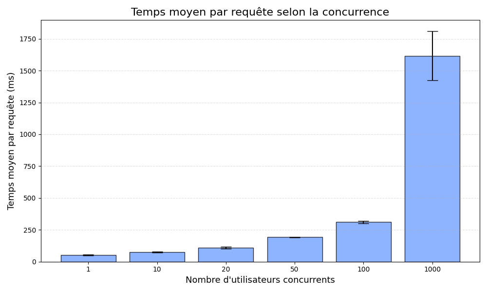
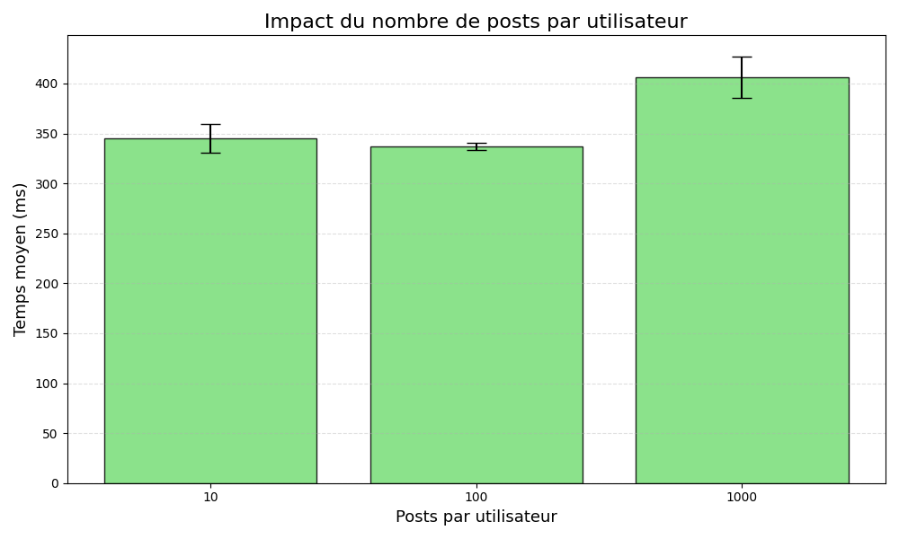
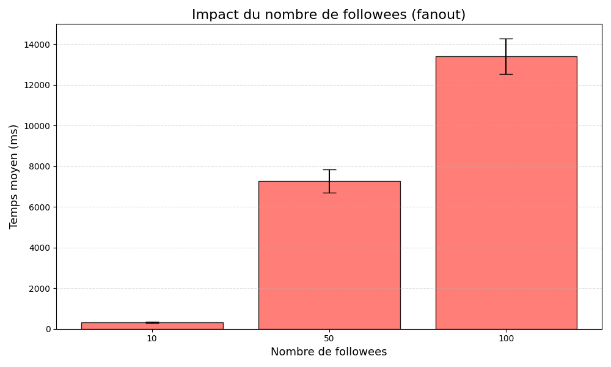

# Massive Data & Cloud – TinyInsta Benchmarks

Ce dépôt contient les scripts et ressources utilisés pour exécuter des benchmarks sur l’application TinyInsta, déployée sur GCP.

Les expériences couvrent principalement :
- la concurrence (nombre d’utilisateurs simultanés),
- la taille des données (nombre total de posts),
- le fanout (nombre de followees par utilisateur).


## 1. Organisation du dépôt

```text
.
├── experiments
│   ├── conc
│   │   ├── analyze_exp1.py
│   │   ├── benchmark_exp1.py
│   │   ├── __pycache__/
│   │   └── seed_exp1.sh
│   ├── fanout
│   │   ├── analyze_exp2_fanout.py
│   │   ├── bench_fanout.py
│   │   ├── increase_fanout.py
│   │   ├── run_fanout_copy.sh
│   │   └── run_fanout.sh
│   ├── post
│   │   ├── analyze_exp2_posts.py
│   │   ├── bench_post_parallel.py
│   │   └── seed_post_level.sh
│   └── wipe_datastore.py
├── massive-gcp-master
│   ├── app.yaml
│   ├── index.yaml
│   ├── main.py
│   ├── NOTES.md
│   ├── README.md
│   ├── requirements.txt
│   └── seed.py
├── out
│   ├── conc.csv
│   ├── fanout.csv
│   └── post.csv
├── plots
│   ├── conc_barplot.png
│   ├── fanout_barplot.png
│   └── post_barplot.png
├── README.md
└── tools
    ├── count_posts.py
    └── count_users.py
```

- `massive-gcp-master/` : code de l’application TinyInsta (App Engine).
- `experiments/` : scripts de seed, de benchmark et d’analyse.
- `out/` : résultats des benchmarks au format CSV.
- `plots/` : graphiques générés à partir des CSV.
- `tools/` : scripts utilitaires pour compter les utilisateurs et les posts.


## 2. Prérequis

### 2.1. Python

- Python 3.x
- Installation des dépendances de l’application dans `massive-gcp-master` :

```bash
cd massive-gcp-master
pip install -r requirements.txt
```

### 2.2. Google Cloud SDK

Un projet Google Cloud configuré et le SDK installé sont nécessaires pour déployer TinyInsta et accéder à Datastore.

- Documentation : https://cloud.google.com/sdk

### 2.3. ApacheBench (ab)

Tous les benchmarks ont été effectués avec l’outil `ab` (ApacheBench).

Exemples d’installation :

- Debian / Ubuntu :

```bash
sudo apt-get update
sudo apt-get install apache2-utils
```

- macOS (Homebrew) :

```bash
brew install httpd
```

La commande `ab` doit ensuite être disponible dans le PATH :

```bash
ab -V
```

### 2.4. Droits d’exécution des scripts shell

Avant d’utiliser les scripts shell, il faut leur donner les droits d’exécution, par exemple :

```bash
chmod +x experiments/conc/seed_exp1.sh
chmod +x experiments/post/seed_post_level.sh
chmod +x experiments/fanout/run_fanout.sh
chmod +x experiments/fanout/run_fanout_copy.sh
```


## 3. Déploiement de l’application TinyInsta

Le code de l’application se trouve dans `massive-gcp-master/`.

Exemple de déploiement sur App Engine (service standard) :

```bash
cd massive-gcp-master

# Authentification et sélection du projet (si nécessaire)
gcloud auth login
gcloud config set project <PROJECT_ID>

# Déploiement
gcloud app deploy
```

L’URL de l’application déployée est ensuite utilisée par les scripts de benchmark dans `experiments/`.


## 4. Scripts utilitaires

Les scripts suivants se trouvent dans le répertoire `tools/` :

- `count_users.py` : compte le nombre d’utilisateurs dans Datastore.
- `count_posts.py` : compte le nombre de posts dans Datastore.

Ils peuvent être utilisés, par exemple, via :

```bash
python tools/count_users.py
python tools/count_posts.py
```


## 5. Expériences

Les résultats des expériences sont stockés dans le répertoire `out/` au format CSV, et les graphiques correspondants dans `plots/`.


### 5.1. Expérience 1 – Concurrence

Répertoire : `experiments/conc/`

- `seed_exp1.sh` : script shell pour initialiser les données nécessaires à l’expérience de concurrence (utilisation du `seed.py` de l’application et/ou appels à Datastore).
- `benchmark_exp1.py` : lance les benchmarks de concurrence, en utilisant l’outil `ab` avec différents niveaux de concurrence. Écrit les résultats dans `out/conc.csv`.
- `analyze_exp1.py` : lit `out/conc.csv` et produit des statistiques et/ou des graphiques (par exemple `plots/conc_barplot.png`).

L’expérience cible typiquement le point d’entrée `/api/timeline` de TinyInsta, avec un nombre variable d’utilisateurs ou de requêtes simultanées.

Exemple d’utilisation (à adapter selon le script) :

```bash
cd experiments/conc

# Préparation des données
./seed_exp1.sh

# Lancement du benchmark
python benchmark_exp1.py

# Analyse des résultats
python analyze_exp1.py
```


### 5.2. Expérience 2 – Taille des données (posts)

Répertoire : `experiments/post/`

Cette expérience fait varier le nombre de posts par utilisateur. Les scripts prennent un paramètre indiquant le nombre de posts par utilisateur (par exemple 10, 100, 1000).

- `seed_post_level.sh` : prépare différents niveaux de taille de données.

  Usage :

  ```bash
  cd experiments/post
  ./seed_post_level.sh <posts_per_user>
  ```

  Exemples :

  ```bash
  ./seed_post_level.sh 10    # ≈ 10 posts par utilisateur (≈ 10 000 posts)
  ./seed_post_level.sh 100   # ≈ 100 posts par utilisateur (≈ 100 000 posts)
  ./seed_post_level.sh 1000  # ≈ 1000 posts par utilisateur (≈ 1 000 000 posts)
  ```

  Le script appelle `seed.py` avec :
  - `USERS = 1000`
  - `FOLLOWS_MIN = 20`
  - `FOLLOWS_MAX = 20`
  - `PREFIX = "user"`

- `bench_post_parallel.py` : lance des benchmarks en parallèle avec `ab`, en ciblant 50 timelines différentes (`user1` à `user50`).

  Usage :

  ```bash
  python bench_post_parallel.py <posts_per_user>
  ```

  Exemples :

  ```bash
  python bench_post_parallel.py 10
  python bench_post_parallel.py 100
  python bench_post_parallel.py 1000
  ```

  Paramètres internes principaux :
  - `APP_HOST = "https://projetmassivedata.appspot.com"`
  - `USERS = 50` (50 timelines testées)
  - `N_REQ_TOTAL = 100` (réparties sur les 50 utilisateurs)
  - `N_REQ_PER_USER = N_REQ_TOTAL // USERS`
  - `CONCURRENCY_PER_USER = 1` (un client `ab` par utilisateur)
  - `RUNS = 3` (3 runs automatiques par valeur de `<posts_per_user>`)
  - Résultats écrits dans `~/ProjetMassiveData/out/post.csv`

  Le script :
  - effectue une requête de “cold start” sur `user1` (non comptabilisée),
  - lance en parallèle 50 processus `ab`,
  - extrait pour chaque utilisateur le `Time per request` et le nombre de requêtes échouées,
  - calcule un temps moyen global et un indicateur `FAILED` global (0 ou 1),
  - ajoute une ligne par run dans `post.csv` :

    ```text
    PARAM,AVG_TIME,RUN,FAILED
    ```

- `analyze_exp2_posts.py` : analyse `out/post.csv` et génère les graphiques associés (`plots/post_barplot.png`).

Exemple de séquence complète pour un niveau de posts donné :

```bash
cd experiments/post

./seed_post_level.sh 100
python bench_post_parallel.py 100
python analyze_exp2_posts.py
```


### 5.3. Expérience 3 – Fanout

Répertoire : `experiments/fanout/`

Cette expérience fait varier le fanout (nombre de followees par utilisateur) pour mesurer l’impact sur les temps de réponse.

Scripts principaux :
- `increase_fanout.py` : ajuste le fanout pour certains utilisateurs dans Datastore.
- `bench_fanout.py` : exécute les benchmarks en utilisant `ab` et écrit les résultats dans `out/fanout.csv`.
- `analyze_exp2_fanout.py` : lit `out/fanout.csv` et produit les graphiques (`plots/fanout_barplot.png`).
- `run_fanout.sh` : script d’orchestration qui enchaîne automatiquement les étapes de l’expérience (reset, seed, augmentation du fanout, benchmarks).

Le script `run_fanout.sh` réalise :

1. Reset du Datastore via `wipe_datastore.py`.
2. Seed initial avec :
   - `USERS = 1000`
   - `POSTS = 100 * USERS`
   - `FOLLOWS_MIN = 10`, `FOLLOWS_MAX = 10` (fanout initial 10)
   - `PREFIX = "user"`
3. Benchmark avec fanout = 10 :
   ```bash
   python bench_fanout.py --param 10
   ```
4. Augmentation du fanout à 50 :
   ```bash
   python increase_fanout.py --target-fanout 50 --prefix "user"
   python bench_fanout.py --param 50
   ```
5. Augmentation du fanout à 100 :
   ```bash
   python increase_fanout.py --target-fanout 100 --prefix "user"
   python bench_fanout.py --param 100
   ```

Usage typique :

```bash
cd experiments/fanout
./run_fanout.sh
```

Les résultats cumulés sont écrits dans `out/fanout.csv`.


## 6. Réinitialisation des données

Le script `experiments/wipe_datastore.py` permet de nettoyer ou réinitialiser les données dans Datastore pour repartir sur une base saine entre deux séries de benchmarks.

Exemple :

```bash
cd experiments
python wipe_datastore.py
```


## 7. Résultats

Les fichiers CSV suivants sont produits par les différents scripts de benchmark :

- `out/conc.csv` : résultats de l’expérience de concurrence.
- `out/post.csv` : résultats de l’expérience sur la taille des données (posts).
- `out/fanout.csv` : résultats de l’expérience sur le fanout.

Les graphiques correspondants sont enregistrés dans le répertoire `plots/` :

- `plots/conc_barplot.png`
- `plots/post_barplot.png`
- `plots/fanout_barplot.png`

## 8. Graphiques

### Concurrence



### Taille des données (posts)



### Fanout




## URL de la webapp déployée

https://projetmassivedata.appspot.com/